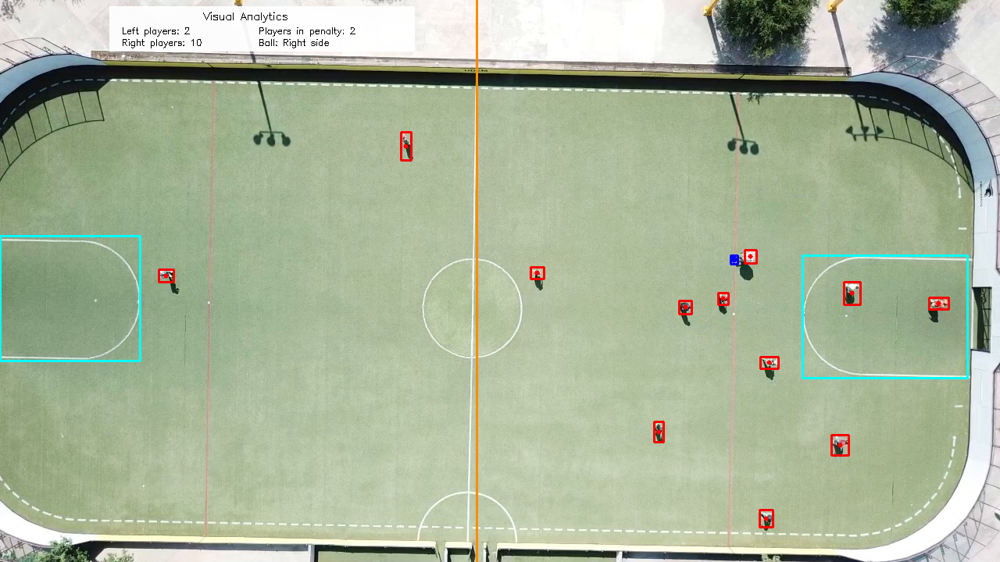

# Sports Analytics con Deep Learning — YOLOv8 + SAHI

Proyecto final para **Inteligencia Artificial II** en la Universidad de Monterrey.  
Pipeline de visión computacional que detecta jugadores de fútbol y el balón en video aéreo de dron y genera analíticas visuales en tiempo real por frame.

---

## Descripción del Proyecto

El proyecto procesa un video aéreo de 2 minutos capturado con un dron DJI Mavic Pro sobre el Campus UDEM. Usando un modelo **YOLOv8** ajustado con transfer learning combinado con **SAHI** (Slicing Aided Hyper Inference), el pipeline:

- Detecta todos los **jugadores** en la cancha (bounding boxes rojos)
- Detecta el **balón** (bounding box azul)
- Identifica regiones de la cancha: áreas de penalti (cyan) y línea de medio campo (naranja)
- Genera **analíticas visuales** superpuestas en el video de salida por frame

### Analíticas visuales calculadas por frame

| Métrica | Descripción |
|---|---|
| Jugadores lado izquierdo | Jugadores detectados en la mitad izquierda de la cancha |
| Jugadores lado derecho | Jugadores detectados en la mitad derecha de la cancha |
| Jugadores en área de penalti | Conteo de jugadores dentro de cualquier área de penalti |
| Posición del balón | Si el balón está en el lado izquierdo o derecho |
| Balón fuera de la cancha | Indicador cuando el balón sale del campo |

### Desempeño del modelo (conjunto de prueba)

| Clase | Precisión | Recall | mAP50 |
|---|---|---|---|
| Jugador (P) | 0.822 | 0.861 | 0.847 |
| Balón (B) | 0.637 | 0.302 | 0.254 |

> La detección del balón es inherentemente más difícil por su tamaño reducido (~4–8 px) en tomas aéreas, desenfoque por movimiento y bajo conteo de píxeles. El slicing con SAHI mejora significativamente el recall.

---

## Ejemplo de Salida

Cada frame procesado tiene el siguiente aspecto:



- Cajas rojas → jugadores detectados  
- Caja azul → balón detectado  
- Punto amarillo → posición predicha del balón (cuando no se detecta)  
- Línea naranja → línea de medio campo  
- Región cyan → área de penalti  

---

## Requisitos

**Python ≥ 3.10**

Instalar todas las dependencias:

```bash
pip install -r requirements.txt
```

---

## Cómo Ejecutar el Proyecto

### Opción A — Google Colab (Recomendado)

1. **Clonar el repositorio**
   ```bash
   git clone https://github.com/Carlos-HC/Sports-Analytics-Using-Deep-Learning'
   ```

2. **Subir a Google Drive** y abrir `SportsAnalytics.ipynb` en Colab.

3. **Montar Drive** (la primera celda lo hace automáticamente):
   ```python
   from google.colab import drive
   drive.mount('/content/drive')
   ```

4. **Colocar los siguientes archivos** en `/content/drive/MyDrive/IA 2/`:
   - `futbol.mp4` — el video aéreo del partido
   - `best_modelo_futbol_v3_optimizado.pt` — pesos del modelo YOLOv8 entrenado
   - `Data/data.yaml` — configuración del dataset

5. **Ejecutar todas las celdas** de arriba hacia abajo. La última celda genera el video de salida con las anotaciones.

---

### Opción B — Máquina Local

1. **Clonar el repositorio**
   ```bash
   git clone https://github.com/Carlos-HC/Sports-Analytics-Using-Deep-Learning
   cd <tu-repo>
   ```

2. **Instalar dependencias**
   ```bash
   pip install -r requirements.txt
   ```

3. **Editar las rutas** en el notebook para apuntar a tus archivos locales en lugar de Google Drive:
   ```python
   project_path = "/ruta/a/tu/proyecto"
   video_path   = "/ruta/a/futbol.mp4"
   model_path   = "/ruta/a/best_modelo_futbol_v3_optimizado.pt"
   ```

4. **Lanzar Jupyter**
   ```bash
   jupyter notebook SportsAnalytics.ipynb
   ```

5. Ejecutar todas las celdas. El video de salida se guardará en la ruta definida en `output_video_path`.

---

## Estructura del Repositorio

```
├── SportsAnalytics.ipynb                  # Notebook principal (entrenamiento + inferencia + analíticas)
├── requirements.txt                     # Dependencias de Python
├── README.md                            # Este archivo
├── best_modelo_futbol_v3_optimizado.pt  # Modelo con pesos entrenados
├── ejemplo-salida.png                   # Imagen utilizada en este archivo para representación de salida
├── futbol.mp4                           # Video utilizado como ejemplo
└── Data/
    └── data.yaml                        # Configuración del dataset en formato YOLO
```
> Los pesos del modelo entrenado (`best_modelo_futbol_v3_optimizado.pt`) y el video original se almacenan en Google Drive por su tamaño, al trabajarse por Google Colab.

---

## Resumen del Pipeline

```
Video (.mp4)
    │
    ▼
Extracción de frames (OpenCV)
    │
    ▼
Inferencia segmentada con SAHI (tiles 320×320, 25% overlap)
    │
    ▼
Detección YOLOv8 (Jugador / Balón / Área de penalti / Medio campo)
    │
    ▼
Filtrado por confianza
  ├── Jugadores  ≥ 0.40, mínimo 8×12 px
  └── Balón      ≥ 0.15, mínimo 4×4 px
    │
    ▼
Tracking del balón (predicción por velocidad en frames sin detección)
    │
    ▼
Cálculo de analíticas visuales
  ├── Conteo izquierda / derecha
  ├── Conteo en área de penalti
  └── Posición del balón
    │
    ▼
Video de salida anotado (.mp4)
```

---

## Resumen de Metodología

- **Modelo**: YOLOv8 ajustado con transfer learning desde un checkpoint previo de detección de fútbol
- **Entrenamiento**: 50 épocas, early stopping (paciencia=10), mejor checkpoint en la época ~22
- **Hiperparámetros**: `imgsz=640`, `batch=8`, `lr0=0.001`, `seed=42`
- **Dataset**: más de 576 frames anotados manualmente en formato YOLO, divididos 70/15/15 (entrenamiento/validación/prueba)
- **Herramienta de anotación**: CVAT / Roboflow
- **Mejora del balón**: el slicing con SAHI incrementa la detección de objetos pequeños que la inferencia de frame completo omite

---

## Equipo

Universidad de Monterrey — Escuela de Ingeniería y Tecnologías  
Materia: Inteligencia Artificial II  
Profesor: Dr. Andrés Hernández Gutiérrez  
Fecha de entrega: 21 de mayo de 2026
